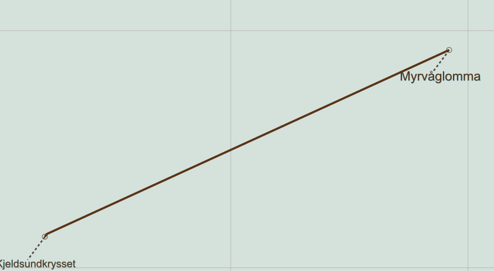

# RouteMap.jl

## What does it do?

Aid in plotting maps of travel routes and condensing route tables, built on top of `Luxor`, `RouteSlopeDistance`, `LuxorLabels` and `LuxorLayout`.

Start by creating and activating a ModelSpace. 

ModelSpace will contain output paper size, font size, the full label collection and a mapping from
world coordinates to model coordinates.

'Activation' establishes a current Cairo recording session, an in-memory current drawing using 
model coordinates from which we can harvest snapshot images. At taking a snapshot, the model is projected 
into paper space, labels are optimized against overlapping, and placed in an overlay.

A route Leg is a path, often with separate paths for separate directions, and two end labels.

User will build and own a collection of Legs, in world (UTM) coordinates.
The function  `add_or_update_if_not_redundant!(legs, ...)` aids
in recognizing when information from different sources can be reduced. For example:

   1) One journey includes a leg, A -> B, and continues. The names and the path is passed to, 
   `add_or_update_if_not_redundant!`, which adds it as a Leg.
   2) Another journey also includes A -> B, but ends at B. The info is passed to, `add_or_update_if_not_redundant!`,
   which recognizes it as a redundant. No new Leg is added to the legs collection. However, 
   B is recognized as a possible journey destination, giving it a higher prominence. 


### Example

Plot a very simple route as vector graphics. A typical script collects data from RouteSlopeDistance.jl and StopsAndTimetables.jl.

```
julia> model = model_activate()
RouteMap.ModelSpace(    countimage_startvalue  = 9,
        colorscheme            = ColorSchemes.ColorScheme{Vector{ColorTypes.RGB{Float64}}, String, String}(ColorTypes.RGB{Float64}[RGB{Float64}(0.347677,0.199863,0.085069), RGB{Float64}(0.560535,0.419142,0.29185), RGB{Float64}(0.729634,0.613774,0.512), RGB{Float64}(0.822643,0.763401,0.698769), RGB{Float64}(0.836049,0.882901,0.85903), RGB{Float64}(0.762289,0.939134,0.951842), RGB{Float64}(0.639101,0.925688,0.971463), RGB{Float64}(0.504741,0.85335,0.938049), RGB{Float64}(0.342992,0.650614,0.772702)], "general", ""),
        world_to_model_factor  = 1.0,
        originE                = 26561,
        originN                = 6940224,
        background             = RGB{Float64}(0.836049,0.882901,0.85903),
        linewidth              = 9.0,
        foreground             = RGB{Float64}(0.347677,0.199863,0.085069),
        FS                     = 22,
        EM                     = 26,
        limiting_height        = Base.RefValue{Int64}(595),
        limiting_width         = Base.RefValue{Int64}(842),
        margin                 = (t = 54, b = 81, l = 72, r = 72),
        labels                 = LabelUTM[],
        utm_grid_size          = 1000,
        utm_grid_thickness     = 0.5)

julia> leg = Leg(; text_A = "Kjeldsundkrysset", prominence_A = 2.0, text_B = "Myrvåglomma", prominence_B = 1.0,
           ABx = [22217.965, 22226.41, 23920.251], ABy = [6.938131025e6, 6.9381427e6, 6.938919173e6])
Leg with  AB <=> BA:
 label_A = LabelUTM("Kjeldsundkrysset", 2.0, 22218.0, 6.93813e6)
 label_B = LabelUTM("Myrvåglomma", 1.0, 23920.0, 6.93892e6)
 bb_utm = BoundingBox(Point(22218.0, 6.93813e6) : Point(23920.3, 6.93892e6))
 ABx =    [22218.0  …  23920.3] (3 elements)
 ABy =    [6.93813e6  …  6.93892e6] (3 elements)

 julia> legs = [leg];

julia> plot_legs_in_model_space_and_push_labels_to_model!(model, legs)
2-element Vector{LabelUTM}:
 LabelUTM("Kjeldsundkrysset", 2.0, 22218.0, 6.938131e6)
 LabelUTM("Myrvåglomma", 1.0, 23920.0, 6.938919e6)

julia> snap() # Show just what's currently on the model canvas in ink extent. Creates 10.png and 10.svg files.

julia> snap_with_labels(model) # Creates 11.png and 11.svg files.
```


# World, model and paper space

- World coordinates are UTM33 coordinates: Easting, Northing. North is up. One unit is practically 1m, depending on the exact map projection. 
- Model coordinates are offset from world coordinates. The ModelSpace structure defines where the model space origin (0, 0) is placed in the world (`orginE`, `originN`). It also defines `world_to_model_factor`, which is normally 1. If the Route map covers a very large area, set it to e.g. 0.001. That means that 1000 m in world space becomes the distance between (0, 0) and (0, 1) in model space.
- The Luxor / Cairo canvas use model coordinates. It is where we plot roads and stuff. The computer graphics convention 'positive y is down' means that we internally apply an extra `world_to_model_factor` = -1 for y. Don't think too much about it, think in world coordinates. 
- The model canvas is limitless. When you draw on it, the ink extents increase. 
- Paper space is a projection of the model canvas onto, by default, an A4 page. This happens when we take a snapshot of the current model.
  We can continue to add graphics to the model, and take further snapshots.
- In paper space, after the model is projected on it, we typically overlay a 1km x 1km grid, and also labels. You don't need to deal with paper space coordinates, but an A4 page (in portrait mode) is 595 x 842 points, and the origin is at the centre of the page. Positive y is down. Model space is projected into an area which is `limiting_width x limiting_height - margin`.


# More on label selection and map sizing

Fitting many readable labels onto the available paper can be challenging. The paper space needed can be
reduced quite a lot by allowing labels to flip diagonally. We use `LuxorLabels.jl` for this.

We can fit labels into a much smaller paper space by using additional modifiers. For example, 
staggering offset distance two by two. Keyword arguments are passed to `LuxorLabels.LabelPaperSpace'.
The keyword values can be singular. E.g. `leaderline = false`, which would apply to all labels.
Or we can differentiate between labels, e.g. `leaderline = [false, true, true]`. Such vector-valued keywords
must have the same number of elements as our model: `length(model.labels) == 3`. 

Overlapping labels are not shown by default, though you get warnings. See `snap_with_labels`.

